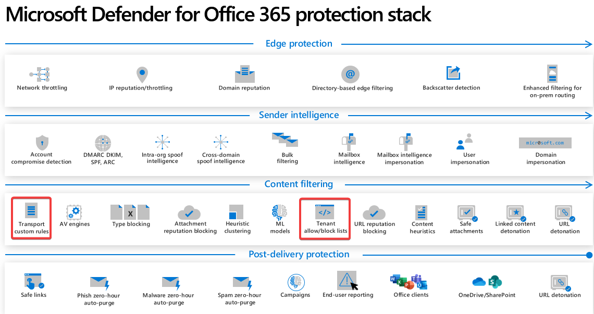
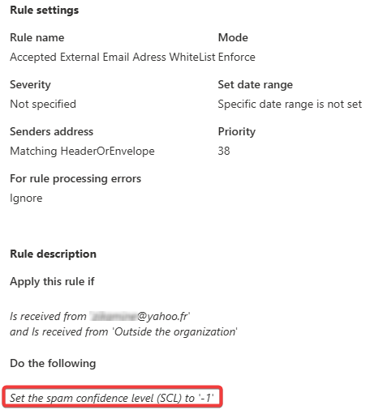
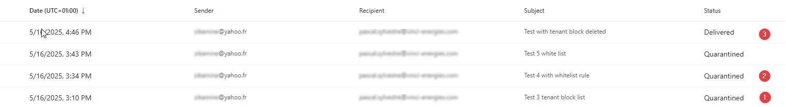
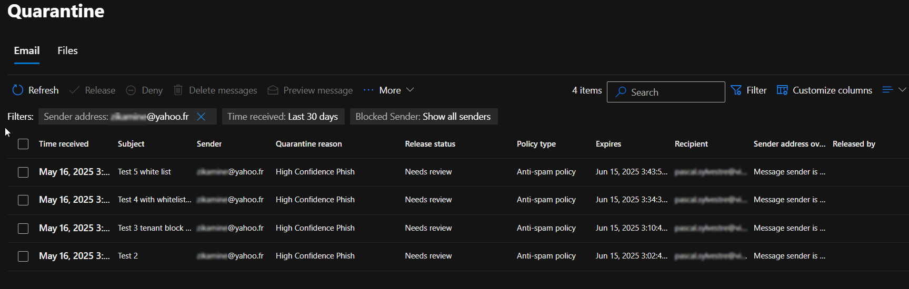
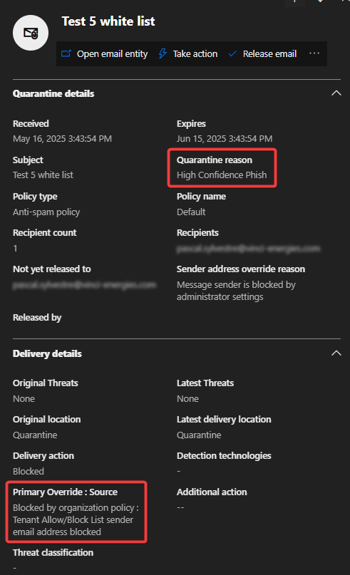

# ⚖️ TABL vs Transport Rules – Which takes precedence?

## 📑 Table of Contents

- [📘 Context](#-context)
- [❓What is TABL actually doing?](#what-is-tabl-actually-doing)
- [🧪 Real-world test: TABL vs Transport Rule](#-real-world-test-tabl-vs-transport-rule)
- [🔍 Observation in Message Trace and Quarantine](#-observation-in-message-trace-and-quarantine)
- [📨 Message Header summary](#-message-header-summary)
- [✅ Conclusion](#-conclusion)
- [📝 Notes](#-notes)

---

## 📘 Context

While working on a real-world scenario, a question arose:

> Between **Transport Rules** and the **Tenant Allow/Block List (TABL)**, which one takes precedence in the message filtering pipeline?

The answer is nuanced and documented in Microsoft's mail protection stack.

📎 Source: [Protection stack in Microsoft Defender for Office 365](https://learn.microsoft.com/en-us/defender-office-365/protection-stack-microsoft-defender-for-office365)

According to the diagram, **custom transport rules** and **TABL** both sit under the "Content Filtering" layer. However, their behavior in practice differs.

---

## ❓What is TABL actually doing?

TABL is not just another filter — it **overrides Defender for Office 365 and EOP verdicts**:

> _"The Tenant Allow/Block List in the Microsoft Defender portal gives you a way to manually override the Defender for Office 365 or EOP filtering verdicts. The list is used during mail flow or time of click for incoming messages from external senders."_

📎 Source: [About the Tenant Allow/Block List](https://learn.microsoft.com/en-us/defender-office-365/tenant-allow-block-list-about#block-entries-in-the-tenant-allowblock-list)

### 🚨 Important notes:
- When a domain is added to the **Block list**, Defender marks the message as **High Confidence Phishing**, assigning an **SCL of 9**.
- The message is then **quarantined**.
- TABL entries also **block outbound emails** from internal users to listed domains or addresses.
- Entries are **automatically removed** by Microsoft after 30 or 90 days unless marked as `never expires`.

---

## 🧪 Real-world test: TABL vs Transport Rule

### 🔨 Scenario:
- A sender was added to the **TABL (Block list)** — expected behavior: assign **SCL 9**.
- A **transport rule** was created to **whitelist** the same sender — expected behavior: set **SCL -1**.

📌 Transport rule configuration (screenshot placeholder)  

Multiple test emails were sent:  

1. TABL block only.  
2. TABL block + Transport rule that sets SCL to -1.  
3. No TABL block anymore.

---

## 🔍 Observation in Message Trace and Quarantine:

In cases 1 and 2:  
The messages never reached the inbox — they were **quarantined**.  

📌 Quarantine details 

---

## 📨 Message Header summary:

**Subject**: Test 5 white list  
**Sender**: *******@yahoo.fr  
**Recipient**: *****@domain.com  

| Date (UTC+01:00)     | Event           | Detail                                                                                                                                                      |
|----------------------|------------------|------------------------------------------------------------------------                                                                                    |
| 5/16/2025, 3:43 PM   | Receive          | Message received by: xxxxxxxx.eurprdXX.prod.outlook.com                                                                                                    |
| 5/16/2025, 3:43 PM   | Spam             | Spam confidence level: 9                                                                                                                                   |
| 5/16/2025, 3:43 PM   | Transport rule   | Transport rule: 'Accepted External Email Adress WhiteList', ID: ('XXXX-XXXX-XXXX-XXXX-XXXXX'), DLP policy: '', ID: (00000000-0000-0000-0000-000000000000). |
| 5/16/2025, 3:43 PM   | Receive          | Message received via TLS1.2 with AES256                                                                                                                    |
| 5/16/2025, 3:43 PM   | Send             | Message transferred.                                                                                                                                       |
| 5/16/2025, 3:44 PM   | Deliver          | Message quarantined in: DefaultFolderType:QuarantinedEmailSecured                                                                                          |

---

## ✅ Conclusion

Despite the transport rule that should have overridden the verdict (SCL -1), **TABL wins** 💪:

- TABL **overrides** both EOP and Defender policies.
- TABL verdicts apply **before** transport rules in practice, even if visually represented at the same layer.
- **Whitelist transport rules cannot bypass TABL block entries**.

📌 **Takeaway**: If you block a sender in TABL, **no transport rule can reverse it** — the message will be quarantined with high confidence.

---

## 📝 Notes

This article is based on real-life testing and public Microsoft documentation.  
Feel free to submit corrections or open a discussion if you have observed different behavior.
